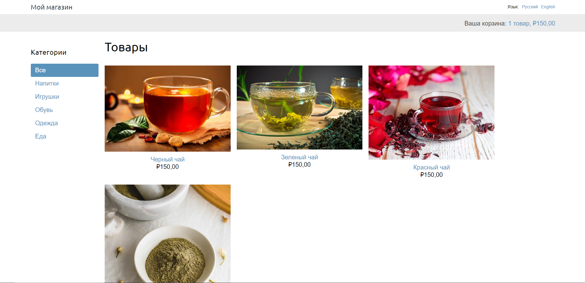

# Мой магазин (My shop)
### ОПИСАНИЕ:
**Мой магазин (My shop)** - это учебный Pet-проект, интернет-магазин, созданный
в рамках изучения чистого Django. 
В проекте реализован следующий функционал:
* приложения: магазин (shop), корзина (cart), заказы (orders), оплата 
  (payment), купоны (coupons); созданы модели, формы, представления, пути, шаблоны.
* корзина с применением сессий (django.contrib.sessions).  
* кастомный context_processor и filter.
* асинхронная отправка e-mail (smtp) о создании заказа c применением Celery, 
  RabbitMQ, Flower.
* кастомная страница заказа в админ-панели (extends "admin/base_site.html").
* оплата заказов с помощью шлюза Stripe, ссылка на платеж в админ-панели.
* веб-перехватчик платежного события для изменения статуса заказа в БД.
* экспорт заказов в csv-файл в админ-панели.
* экспорт платежей в pdf-файл в админ-панели.
* система купонов, встроенная в заказы и платежи шлюза Stripe.
* система рекомендаций товаров в корзине и детальном описании товара 
  c применением хранилища Redis.
* система интернационализации и локализации (LocaleMiddleware, gettext,
django-rosetta, django-parler, django-localflavor)

### СТЕК ТЕХНОЛОГИЙ:

Python 3.12, Django 5.0.7, Redis 5.0

### Фото главной страницы:


### ЛОКАЛЬНАЯ УСТАНОВКА (для Windows):

1. Клонируй проект и перейди в него:
```shell
git clone git@github.com:smaspb17/my_shop.git
cd my_shop
```

2. Создай и активируй виртуальное окружение: 
```shell
python -m venv venv
venv/Scripts/activate
```

3. Установи зависимости:
```shell
pip install -r requirements.txt
```

4. При необходимости обнови пакетный менеджер pip:
```shell
python -m pip install --upgrade pip
```

5. Создай файл .env (в контейнере проекта `my_shop/`) и заполни его 
   переменными, указанными в файле example.env. Для системы оплаты, 
   зарегистрируйся в соответствующих сервисах и скопируй ключи.

6. Перейди в пакет проекта (`my_shop/my_shop/`, где находится файл
   manage.py) и выполни миграции:
```shell
cd my_shop/
python manage.py makemigrations
python manage.py migrate
```

7. Создай суперпользователя:
```shell
python manage.py createsuperuser
```

8. Открой Docker Desktop, cкачай образ RabbitMQ и запусти контейнер на ПК:
```shell
docker pull rabbitmq
docker run -it --rm --name rabbitmq -p 5672:5672 -p 15672:15672 rabbitmq:management
```

9. Пройди адресу http://127.0.0.1:15672/ для просмотра пользовательского 
    интерфейса управления RabbitMQ.

10. Открой еще одну оболочку и запустите работника Celery из каталога проекта:
```shell
celery -A my_shop worker -l info --pool=threads --concurrency=8
```
Проблема запуска Celery на Windows в статьях:
https://celery.school/celery-on-windows
https://celery.school/celery-worker-pools.

12. Открой еще одну оболочку и запустите инструмент мониторинга Flower:
```shell
celery -A my_shop flower
```
просмотр интерфейса Flower по адресу http://localhost:5555/.

13. Открой еще одну оболочку и запусти сервер разработки:
```shell
python manage.py runserver
```

Теперь ты можешь использовать проект на своём компьютере. 
Если ты хочешь остановить проект, нажми Ctrl+C в терминале, 
а затем деактивируй виртуальное окружение командой:
```shell
deactivate
```

### АВТОР:
Шайбаков Марат

### ЛИЦЕНЗИЯ:
Apache License 2.0

### КОНТАКТЫ:
smaspb17@yandex.ru